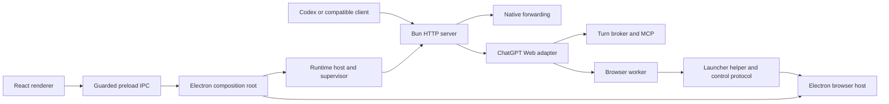

# NEKODEX architecture

This is the maintained architecture of this checkout. Use it with the
[feature extension guide](docs/development/extending-nekodex.md) and generated
[module/dependency map](docs/development/module-map.json). Historical review
reports describe their revisions; they do not override current source. Detailed
[mode and operational contracts](docs/architecture.md) remain a companion reference.

## Product and runtime boundaries

NEKODEX combines a Bun service implementing a Responses-compatible bridge with
an Electron desktop application for accounts, browser turns, tools and runtime
supervision. React renders the launcher UI. Native provider forwarding, automatic
ChatGPT browser execution and Manual handoff are distinct transports.

These arrows describe communication and authority, not permission to import an
orchestration module into every dependency. Browser selection, account identity,
connector readiness, runtime readiness and installed release identity are
separate facts.

## Entry points and responsibilities

| Area | Entry points / owners | Boundary |
| --- | --- | --- |
| CLI and service | [cli.ts](src/cli.ts), [service.ts](src/service.ts), [server.ts](src/server.ts) | Configuration selects host/port; server admission, local-request checks and stream settlement protect the HTTP boundary. Default configuration uses port 17841. |
| Request parsing | [Responses parser](src/responses/parser.ts), [schema](src/responses/schema.ts), [HTTP body](src/http-body.ts) | Validate input before dispatch; transformed bytes require matching headers. |
| Response translation | [SSE bridge](src/bridge.ts), [JSON projection](src/responses/json-output.ts), [shared output policy](src/responses/output-policy.ts) | Stream cancellation/backpressure stay with SSE; both forms use the same usage/error/tool conventions. Unknown usage is not zero. |
| Continuations | [continuation scope](src/responses/continuation-scope.ts), [owner derivation](src/responses/continuation-owner.ts), [state](src/responses/state.ts), [snapshot codec](src/responses/state-snapshot.ts) | Scope derivation has no disk side effects. Live retention/persistence and snapshot encoding are separate; response IDs must remain bound to their owner. |
| Native transport | [forwarding](src/native-passthrough.ts), [request preparation](src/native-request-preparation.ts), [network routing](src/native-network.ts), [body delivery](src/native-response-body.ts), [terminal inspector](src/native-terminal-inspector.ts) | Preserve authoritative bytes and cancellation. Telemetry observes outcomes; it cannot change delivery or invent provider usage. |
| Web orchestration | [adapter](src/adapters/chatgpt-web/index.ts), [turn runtime](src/adapters/chatgpt-web/turn-runtime.ts), [execution registry](src/adapters/chatgpt-web/turn-execution.ts), [session](src/adapters/chatgpt-web/turn-session.ts) | One runtime/registry owns a turn. Reconnection replays journalled events instead of submitting another browser task. |
| MCP and tools | [MCP server](src/adapters/chatgpt-web/mcp-server.ts), [routing](src/adapters/chatgpt-web/mcp-tool-routing.ts), [broker](src/adapters/chatgpt-web/turn-broker.ts), [owned operations](src/adapters/chatgpt-web/turn-broker-owned-operations.ts) | Schema discovery is not authorization. Bind invocation and result acknowledgement to exact turn/operation identities; keep replay guards. |
| Environment authority | [environment](src/adapters/chatgpt-web/environment.ts), [envelope syntax](src/adapters/chatgpt-web/environment-envelope.ts), [resolver](src/adapters/chatgpt-web/thread-environment-resolver.ts) | Parsing an envelope does not establish provenance or grant access to a working directory. |
| Prompt and files | [prompt compiler](src/adapters/chatgpt-web/prompt.ts), [multipart contract](src/adapters/chatgpt-web/prompt-multipart-contract.ts), [input policy](src/adapters/chatgpt-web/browser-input-policy.ts), [attachments](src/adapters/chatgpt-web/attachment-payloads.ts), [file content](src/responses/file-content.ts) | Keep request validation, authorized bytes, transport formatting and account capacity independent. Multipart acknowledgements and commit identify one transaction. |
| Browser automation | [worker](src/adapters/chatgpt-web/browser-worker.ts), [model selection](src/adapters/chatgpt-web/browser-model-selection.ts), [submission DOM](src/adapters/chatgpt-web/browser-submission-dom.ts), [response DOM](src/adapters/chatgpt-web/browser-response-dom.ts) | Worker owns acquisition/send/rebind/settlement. DOM readers return observations; cached evidence remains tied to the document/turn. |
| Progress and diagnostics | [response policy](src/adapters/chatgpt-web/browser-response-policy.ts), [visible trace](src/adapters/chatgpt-web/browser-visible-trace.ts), [diagnostics](src/adapters/chatgpt-web/browser-diagnostics.ts) | Live external work suspends terminal grace windows, not the task deadline. Diagnostics retain bounded structural evidence; screenshots are opt-in. |
| Compaction | [transaction](src/adapters/chatgpt-web/compaction-transaction.ts), [run registry](src/adapters/chatgpt-web/compaction-run-registry.ts), [active source](src/adapters/chatgpt-web/active-compaction-source.ts), [rolling checkpoint](src/adapters/chatgpt-web/rolling-checkpoint.ts) | Logical cancellation and physical settlement differ. Publish a checkpoint in memory only after its durable write succeeds. |
| Configuration/setup | [config](src/config.ts), [setup](src/setup.ts), [setup policy](src/setup-policy.ts), [file transactions](src/file-transactions.ts), [Codex integration](src/codex-integration.ts) | Bind candidate writes to the original snapshot. A committed-write receipt differs from a before-image; rollback cannot overwrite a newer owner's edit. |
| Tunnel | [installation/control](src/tunnel.ts), [status interpretation](src/tunnel-status.ts), [service](src/tunnel-service.ts) | Inventory/diagnostics parsing has no process authority. Installation, credentials and readiness remain separate steps. |
| Electron composition | [main](launcher/electron/main.cjs), [preload](launcher/electron/preload.cjs), [IPC registrars](launcher/electron/ipc), [control server](launcher/electron/control-server.cjs) | Main owns guarded IPC and composition. Renderer inputs and helper calls cross validation/admission boundaries. |
| Browser ownership | [host](launcher/electron/browser-host.cjs), [turn lifecycle](launcher/electron/browser-turn-lifecycle.cjs), [Manual turns](launcher/electron/browser-manual-turns.cjs), [artifact transfers](launcher/electron/browser-artifact-transfers.cjs), [workspaces](launcher/electron/browser-workspace-windows.cjs) | One shared tab map. Ledger settlement precedes removal receipts. Manual policy uses explicit ports; artifact delivery rechecks exact ownership after awaiting download. |
| Accounts/authentication | [account pool](launcher/electron/account-pool.cjs), [browser display projection](launcher/electron/account-browser-snapshot.cjs), [registry](launcher/electron/account-registry.cjs), [operation leases](launcher/electron/account-operation-leases.cjs), [Codex login](launcher/electron/codex-login.cjs), [browser login](src/browser-login.ts) | Preserve account/principal/flow identity and exact operation leases. Only the selected host supplies full navigation observations; other hosts supply turn rows. Display projection has no session authority. Temporary verification failure does not establish logout. |
| Runtime supervision | [runtime host](launcher/electron/runtime.cjs), [supervisor](launcher/electron/runtime-supervisor.cjs), [generation store](launcher/electron/runtime-generation.cjs), [tunnel policy](launcher/electron/runtime-tunnel-policy.cjs), [output decoder](launcher/electron/runtime-output.cjs) | RuntimeHost owns setup transitions; supervisor owns daemon/tunnel processes and readiness. Decode split UTF-8 once and bound every log line independently of raw capture. |
| Updates | [controller](launcher/electron/update.cjs), [release policy](launcher/electron/update-release-policy.cjs), [staging](launcher/electron/update-staging.cjs), [validation](launcher/electron/update-validation.cjs), [worker](launcher/electron/update-worker.cjs) | Packaged repository/channel selects candidates; signature validation, preparation, handoff and detached installation are separate owners. |
| Usage | [Native contract](src/usage/native-contract.ts), [outbox](src/native-usage-outbox.ts), [durable store](launcher/electron/usage-store.cjs), [report projection](launcher/electron/usage-report.cjs) | Receipt validation and persistence remain independent of UI aggregation. Preserve unknown fields and source/account scope. |
| UI | [App](launcher/src/App.tsx), [deferred surfaces](launcher/src/deferred-surface.tsx), [presentation log store](launcher/src/launcher-log-store.ts), [Onboarding](launcher/src/Onboarding.tsx), [Accounts](launcher/src/AccountSettings.tsx), [Browser](launcher/src/BrowserSurface.tsx), [Activity](launcher/src/ActivitySurface.tsx), [Task Center](launcher/src/TaskCenter.tsx), [Settings](launcher/src/SettingsSurface.tsx) | App owns shell/navigation/shared snapshots. Optional screens load on navigation; logs update subscribed views instead of App. Feature surfaces and hooks own local drafts/actions; late results stay with their original account/query/flow. |
| DEV harness | [CLI](src/dev-chat/cli.ts), [driver](src/dev-chat/driver.ts), [session store](src/dev-chat/session.ts), [context fixtures](src/dev-chat/context-fixtures.ts), [transport](src/dev-chat/transport.ts) | Isolated DEV state and inert generated content are distinct. The harness attaches to the launcher's existing DEV tunnel rather than taking over supervision. |
| Build and distribution | [runtime bundler](scripts/build-runtime-bundle.ts), [owned build output](scripts/build-output.cjs), [launcher scripts](launcher/scripts), [CI](.github/workflows/ci.yml), [release workflow](.github/workflows/release.yml) | Generated output must be owned before replacement. Development checks precede separately authorized packaging/publication. |

## Important end-to-end flows

1. **Web request:** parse and route → derive continuation/environment ownership →
   create or recover turn session → compile prompt/attachments → acquire the owned
   browser page → submit once → observe browser/MCP progress → journal events →
   translate to SSE/JSON → settle and retain only the permitted continuation.
2. **Native request:** prepare route/body → obtain the permitted network route →
   forward bytes → inspect terminal usage without changing delivery → enqueue a
   validated receipt for the launcher. Client cancellation stops that caller's
   wait without cancelling unrelated shared resolution.
3. **Manual request:** reserve an owned tab → copy prompt → wait for user Sent
   confirmation → execute through the harness → settle. The human submission
   deadline ends at Sent. Runtime cancellation must be acknowledged before the
   tab is removed; delayed acknowledgements cannot retire a replacement owner.
4. **Account sign-in:** capture target account/flow → acquire the exclusive lease
   → verify the captured session/principal → publish a matching receipt → release
   after owned work settles. A failed start with unknown host state requires a
   fresh status read before another start.
5. **Setup/change:** read original configuration snapshot → compute candidate →
   coordinate runtime drain/transition → publish files with receipts → verify →
   commit the new runtime generation. Recovery preserves newer external changes.
6. **Update:** select a compatible release from the packaged repository → verify
   metadata → acquire authenticated bytes → validate staging → hand off to one
   detached installer → observe its terminal result before selecting the new UI.

## State and persistence

Resolve paths through [core configuration](src/config.ts) and the
[launcher profile](launcher/electron/profile.cjs). Do not embed an individual
developer's worktree, account, token or home directory in application code.

Renderer presentation work is separate from runtime correctness. Accounts,
Settings, Task Center, Activity and Updates load through a shared Suspense/error
boundary on first use; a failed feature load leaves shell navigation available
and offers an explicit renderer reload. The initial shell and IPC subscriptions
remain mounted. The log store retains the latest 300 records, reconciles startup
events with the initial snapshot and gives rows stable local identities. Only
Overview and Activity subscribe; notifications during bursts are grouped at
100 ms without relying on animation frames. Unsubscribing the last view cancels
the timer. Durable logs and immediate lifecycle/error/task events remain owned
by their existing layers. Activity usage aggregation does not rerender for logs.

Account snapshots compose one full selected-host observation plus tab-only
observations for other hosts; no cached authentication/navigation state is
introduced. Usage projection filters receipts once and sorts each duration set
once for both median and p95, without changing the durable store or unknown-data
semantics.

| State | Owner and rule |
| --- | --- |
| Runtime config / Codex integration | Setup, file transactions and integration journal; compare the snapshot that produced the candidate. |
| Responses continuations | `responses/state.ts` and bounded snapshot codec; ownership scope is hashed, persisted and checked on reuse. |
| Turn journal, broker operations, tab/task ledger | Each layer retains its own delivery/ownership evidence; none may infer that another layer completed solely from a local counter. |
| Browser sessions and account registry | Account-bound storage and verification markers; inspected bytes must match the snapshot being attested. |
| Workspaces | Durable saved rows remain retry targets when live-window deletion cannot persist. |
| Usage | Native outbox plus launcher durable store; report projections do not rewrite receipts. |
| Rolling checkpoints | Original file snapshot + committed receipt; cache publication follows the successful disk write. |
| Installed runtime / updates | Versioned generation and transaction evidence; source HEAD, built bundle, installed app and active process may differ. |

## Development and verification

- Core types: `bun run typecheck`. Renderer types: `bun run --cwd launcher typecheck`.
- Renderer build: `bun run --cwd launcher build:renderer`. Browser helper:
  `bun run scripts/build-browser-helper.ts`.
- Use named, relevant behavioral cases. Root `bun run verify` invokes broad
  suites, audits and release-oriented build/smoke work; it is not a default check.
- [Renderer fixtures](launcher/tests/fixtures/ui-preview.cjs) use synthetic IPC.
  [Source Electron verification](launcher/tests/architecture-refactor-electron-preview.cjs)
  uses a temporary DEV profile and real preload IPC. Neither proves live provider
  behavior or an installed release.
- Bind Electron automation to the exact source renderer URL and then confirm its
  DEV profile. `firstWindow()` can select an embedded blank guest instead.
- Start the source DEV target through `bun run launcher:dev` with an explicit
  `CODEX_WEB_GPT_DEV_HOME` when needed. The similarly named `dev:launcher` follows
  a different CLI path; inspect its target before using it as source proof.
- Close task-owned temporary browsers/processes and remove disposable profiles;
  preserve production and unrelated work. Do not publish installable assets as a
  side effect of a source refactor.
- For an explicit performance comparison, [measure UI work](launcher/scripts/measure-ui-work.cjs)
  against a freshly built renderer and [compare usage projection](launcher/scripts/measure-usage-projection.cjs)
  against a supplied Git ref. Both use synthetic data; their timings/React commit
  counts do not measure provider latency or installed-app startup. See the
  [performance review](docs/reviews/performance-refactor-20260922.md) for the
  recorded comparison and targeted behavior checks.

## Keeping this architecture current

The installed `nekodex-architecture` skill and [AGENTS.md](AGENTS.md) define the
maintenance workflow. Update this document and the extension guide in the same
change when responsibilities, ownership, flows, persistence or public contracts
change. Do not manufacture documentation churn for an internal correction.

Run `bun run architecture:update` after file/import changes, review the generated
map, then run `bun run architecture:check`. CI checks the map and local document
links. The map records files in its explicit roots plus static runtime imports;
it excludes generated output, dependencies and type-only/computed import edges.
It is a navigation/drift aid, not proof that semantic documentation is complete.
The responsible agent must review those semantic changes. No background watcher
or scheduled application access is required.
