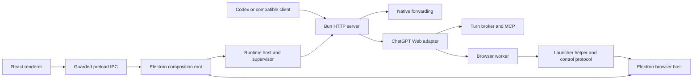

# NEKODEX architecture

This is the maintained architecture of this checkout. Use it with the
[feature extension guide](docs/development/extending-nekodex.md) and generated
[module/dependency map](docs/development/module-map.json). Historical review
reports describe their revisions; they do not override current source. Detailed
[mode and operational contracts](docs/architecture.md) remain a companion reference.

## Product and runtime boundaries

NEKODEX combines a Bun service implementing a Responses-compatible bridge with
an Electron desktop application for accounts, browser turns, tools and runtime
supervision. React renders the launcher UI. Native provider forwarding, automatic
ChatGPT browser execution and Manual handoff are distinct transports.

```mermaid
flowchart LR
  Client[Codex or compatible client] --> HTTP[Bun HTTP server]
  HTTP --> Native[Native forwarding]
  HTTP --> Adapter[ChatGPT Web adapter]
  Adapter --> Broker[Turn broker and MCP]
  Adapter --> Worker[Browser worker]
  Worker --> Helper[Launcher helper and control protocol]
  Helper --> Host[Electron browser host]
  UI[React renderer] --> Preload[Guarded preload IPC]
  Preload --> Main[Electron composition root]
  Main --> Host
  Main --> Runtime[Runtime host and supervisor]
  Runtime --> HTTP
```

These arrows describe communication and authority, not permission to import an
orchestration module into every dependency. Browser selection, account identity,
connector readiness, runtime readiness and installed release identity are
separate facts.

## Entry points and responsibilities

| Area | Entry points / owners | Boundary |
| --- | --- | --- |
| CLI and service | [cli.ts](src/cli.ts), [argument helpers](src/lib/cli-args.ts), [service.ts](src/service.ts), [LaunchAgent helpers](src/launch-agent.ts), [server.ts](src/server.ts) | Configuration selects host/port; server admission, local-request checks and stream settlement protect the HTTP boundary. Default configuration uses port 17841. The daemon and tunnel services share LaunchAgent path, launchd domain and status-probe helpers; each keeps its own label, plist template and timeouts. |
| Request parsing | [Responses parser](src/responses/parser.ts), [schema](src/responses/schema.ts), [HTTP body](src/http-body.ts) | Validate input before dispatch; transformed bytes require matching headers. |
| Response translation | [SSE bridge](src/bridge.ts), [JSON projection](src/responses/json-output.ts), [shared output policy](src/responses/output-policy.ts) | Stream cancellation/backpressure stay with SSE; both forms use the same usage/error/tool conventions. Unknown usage is not zero. |
| Continuations | [continuation scope](src/responses/continuation-scope.ts), [owner derivation](src/responses/continuation-owner.ts), [state](src/responses/state.ts), [snapshot codec](src/responses/state-snapshot.ts) | Scope derivation has no disk side effects. Live retention/persistence and snapshot encoding are separate; response IDs must remain bound to their owner. |
| Native transport | [forwarding](src/native-passthrough.ts), [request preparation](src/native-request-preparation.ts), [network routing](src/native-network.ts), [body delivery](src/native-response-body.ts), [terminal inspector](src/native-terminal-inspector.ts) | Preserve authoritative bytes and cancellation. Telemetry observes outcomes; it cannot change delivery or invent provider usage. |
| Web orchestration | [adapter](src/adapters/chatgpt-web/index.ts), [turn runtime](src/adapters/chatgpt-web/turn-runtime.ts), [execution registry](src/adapters/chatgpt-web/turn-execution.ts), [session](src/adapters/chatgpt-web/turn-session.ts), [tool-result projection](src/adapters/chatgpt-web/broker-tool-result.ts) | One runtime/registry owns a turn. Reconnection replays journalled events instead of submitting another browser task. Ordinary rounds and active compaction share one Codex tool-result to broker payload projection. |
| MCP and tools | [MCP server](src/adapters/chatgpt-web/mcp-server.ts), [routing](src/adapters/chatgpt-web/mcp-tool-routing.ts), [broker](src/adapters/chatgpt-web/turn-broker.ts), [owned operations](src/adapters/chatgpt-web/turn-broker-owned-operations.ts) | Schema discovery is not authorization. Bind invocation and result acknowledgement to exact turn/operation identities; keep replay guards. |
| Environment authority | [environment](src/adapters/chatgpt-web/environment.ts), [envelope syntax](src/adapters/chatgpt-web/environment-envelope.ts), [resolver](src/adapters/chatgpt-web/thread-environment-resolver.ts) | Parsing an envelope does not establish provenance or grant access to a working directory. |
| Prompt and files | [prompt compiler](src/adapters/chatgpt-web/prompt.ts), [context envelope](src/adapters/chatgpt-web/prompt-context-envelope.ts), [multipart contract](src/adapters/chatgpt-web/prompt-multipart-contract.ts), [input policy](src/adapters/chatgpt-web/browser-input-policy.ts), [attachments](src/adapters/chatgpt-web/attachment-payloads.ts), [file content](src/responses/file-content.ts) | Keep request validation, authorized bytes, transport formatting and account capacity independent. Multipart acknowledgements and commit identify one transaction. |
| Browser automation | [worker](src/adapters/chatgpt-web/browser-worker.ts), [model selection](src/adapters/chatgpt-web/browser-model-selection.ts), [page guards](src/adapters/chatgpt-web/browser-page-guards.ts), [stage budget](src/adapters/chatgpt-web/browser-stage-budget.ts), [submission policy](src/adapters/chatgpt-web/browser-submission-policy.ts), [submission DOM](src/adapters/chatgpt-web/browser-submission-dom.ts), [response DOM](src/adapters/chatgpt-web/browser-response-dom.ts) | Worker owns acquisition/send/rebind/settlement and chooses each stage and its budget. Page guards classify blocking dialogs/alerts without owning the page; the stage budget owns timeout and sleep-refund mechanics; submission policy is pure evidence/turn-identity logic the worker consults. DOM readers return observations; cached evidence remains tied to the document/turn. |
| Progress and diagnostics | [response policy](src/adapters/chatgpt-web/browser-response-policy.ts), [visible trace](src/adapters/chatgpt-web/browser-visible-trace.ts), [diagnostics](src/adapters/chatgpt-web/browser-diagnostics.ts) | Live external work suspends terminal grace windows, not the task deadline. Diagnostics retain bounded structural evidence; screenshots are opt-in. |
| Compaction | [transaction](src/adapters/chatgpt-web/compaction-transaction.ts), [run registry](src/adapters/chatgpt-web/compaction-run-registry.ts), [active source](src/adapters/chatgpt-web/active-compaction-source.ts), [rolling checkpoint](src/adapters/chatgpt-web/rolling-checkpoint.ts) | Logical cancellation and physical settlement differ. Publish a checkpoint in memory only after its durable write succeeds. |
| Configuration/setup | [config](src/config.ts), [setup](src/setup.ts), [setup policy](src/setup-policy.ts), [file transactions](src/file-transactions.ts), [Codex integration](src/codex-integration.ts) | Bind candidate writes to the original snapshot. `useSavedChats` defaults off, validates as a boolean, and remains independent of fresh-per-turn behavior. A committed-write receipt differs from a before-image; rollback cannot overwrite a newer owner's edit. |
| Account tunnels | [binding store](launcher/electron/account-tunnels.cjs), [peer supervisor](launcher/electron/account-tunnel-supervisor.cjs), [account pool](launcher/electron/account-pool.cjs), [runtime host](launcher/electron/runtime.cjs) | `accountTunnelMode` enables strict one-account/one-mode ownership. `accountTunnels` holds distinct cloud IDs, aliases, profiles and private key paths. A captured config generation and private immutable key are prepared before only the affected peer stops; commit checks the captured config bytes and link target. Peer startup creates the private profile before inventory; healthy peer monitoring describes transport readiness while the production parent owns broker admission. Missing/unready bindings never borrow another account's tunnel. New or explicitly reconfigured bindings derive SDK-global aliases from the canonical application home, account and mode so DEV and production cannot collide; loading a saved binding does not silently rename it. Changed sign-in fingerprints retire readiness. Native forwarding and healthy peers remain independent. |
| Tunnel | [installation/control](src/tunnel.ts), [status interpretation](src/tunnel-status.ts), [service](src/tunnel-service.ts) with [LaunchAgent helpers](src/launch-agent.ts) | Inventory/diagnostics parsing has no process authority. Scoped stopped proof requires successful inspection, an explicitly non-running process and stopped state; the SDK's missing/null/empty error values mean no status error. Installation, credentials and readiness remain separate steps. |
| Electron composition | [main](launcher/electron/main.cjs), [preload](launcher/electron/preload.cjs), [IPC registrars](launcher/electron/ipc), [control server](launcher/electron/control-server.cjs) | Main owns guarded IPC and composition. Renderer inputs and helper calls cross validation/admission boundaries. |
| Browser ownership | [host](launcher/electron/browser-host.cjs), [turn lifecycle](launcher/electron/browser-turn-lifecycle.cjs), [Manual turns](launcher/electron/browser-manual-turns.cjs), [artifact transfers](launcher/electron/browser-artifact-transfers.cjs), [workspaces](launcher/electron/browser-workspace-windows.cjs), [navigation policy](launcher/electron/browser-navigation-policy.cjs), [session probe script](launcher/electron/browser-auth-probe.cjs), [in-page session check](launcher/electron/browser-session-observation.cjs), [app user agent](launcher/electron/browser-user-agent.cjs), [network egress check](launcher/electron/network-egress-check.cjs), [announcement dismissal](launcher/electron/browser-announcements.cjs) | One shared tab map. Ledger settlement precedes removal receipts. Concrete task auth redirects retire cached identity and emit an authentication-required release receipt; a false completion becomes a retained failure, while explicit cancellation keeps its own outcome. Manual policy uses explicit ports; artifact delivery rechecks exact ownership after awaiting download. URL policy (including the toolbar address resolution), the page probe, the in-page session check and the automatic-surface announcement dismissal are stateless leaves; a typed ChatGPT address always loads in the ChatGPT tab so retained task tabs keep their conversation. The app presents one stable Chromium user agent on every view and cross-site frame because Cloudflare binds its clearance to it. After a Cloudflare challenge the host checks, at most every ten minutes and in a throwaway session with the account's network settings, whether the public address changes between connections, and publishes only the verdict; the host owns probe sequencing, dismissal enablement and published authentication state. |
| OpenAI API panel | [panel policy](launcher/electron/openai-api-panel.cjs), [workspace window owner](launcher/electron/browser-workspace-windows.cjs), [host](launcher/electron/browser-host.cjs), [account pool](launcher/electron/account-pool.cjs) | Human-operated Tunnels/API keys windows use the explicitly selected account session and fixed Platform destinations. The panel stays outside task descriptors, does not persist portal/OAuth URLs in ChatGPT workspace manifests, and participates in account authentication mutation leases. Opening a panel does not establish tunnel access or create a ChatGPT connector. |
| Accounts/authentication | [account pool](launcher/electron/account-pool.cjs), [browser display projection](launcher/electron/account-browser-snapshot.cjs), [registry](launcher/electron/account-registry.cjs), [operation leases](launcher/electron/account-operation-leases.cjs), [Codex login](launcher/electron/codex-login.cjs), [browser login](src/browser-login.ts) | Preserve account/principal/flow identity and exact operation leases. Only the selected host supplies full navigation observations; other hosts supply turn rows. Display projection has no session authority. Temporary verification failure does not establish logout. |
| Runtime supervision | [runtime host](launcher/electron/runtime.cjs), [supervisor](launcher/electron/runtime-supervisor.cjs), [generation store](launcher/electron/runtime-generation.cjs), [tunnel policy](launcher/electron/runtime-tunnel-policy.cjs), [output decoder](launcher/electron/runtime-output.cjs) | RuntimeHost owns setup transitions; supervisor owns daemon/tunnel processes and readiness. Decode split UTF-8 once and bound every log line independently of raw capture. |
| Updates | [controller](launcher/electron/update.cjs), [release policy](launcher/electron/update-release-policy.cjs), [staging](launcher/electron/update-staging.cjs), [validation](launcher/electron/update-validation.cjs), [worker](launcher/electron/update-worker.cjs) | Packaged repository/channel selects candidates; signature validation, preparation, handoff and detached installation are separate owners. |
| Usage | [Native contract](src/usage/native-contract.ts), [outbox](src/native-usage-outbox.ts), [durable store](launcher/electron/usage-store.cjs), [report projection](launcher/electron/usage-report.cjs) | Receipt validation and persistence remain independent of UI aggregation. Preserve unknown fields and source/account scope. |
| UI | [App](launcher/src/App.tsx), [shell chrome](launcher/src/AppShell.tsx), [update controls](launcher/src/useUpdateControls.ts), [deferred surfaces](launcher/src/deferred-surface.tsx), [presentation log store](launcher/src/launcher-log-store.ts), [Onboarding](launcher/src/Onboarding.tsx), [Accounts](launcher/src/AccountSettings.tsx), [Browser](launcher/src/BrowserSurface.tsx), [Activity](launcher/src/ActivitySurface.tsx), [Task Center](launcher/src/TaskCenter.tsx), [Settings](launcher/src/SettingsSurface.tsx) | App owns shell state/navigation/shared snapshots; AppShell renders prop-driven chrome and the compact-drawer focus trap, and `useUpdateControls` owns update check/install/cancel state. Optional screens load on navigation; logs update subscribed views instead of App. Settings exposes saved-chat preference through guarded preload IPC; saved/temporary behavior remains a runtime/browser contract. Feature surfaces and hooks own local drafts/actions; late results stay with their original account/query/flow. |
| Design system | [tokens](launcher/src/tokens.css), [component kit](launcher/src/design/index.ts), [kit styles](launcher/src/design/components.css), [appearance](launcher/src/theme.ts), [modal focus](launcher/src/modal-focus.ts) | Tokens own every colour and scale; dark is the default and light applies through `html[data-theme]`, set from the saved Appearance preference by `theme.ts` (and before first render by `theme-boot.ts`, from the appearance the renderer last applied or else the theme the main process resolved and passes as `?theme=`). Kit components are presentational: props in, callbacks out, no IPC or launcher state, and user-visible labels come from the caller's localized copy. Surfaces compose the kit and keep only layout in `launcher/src/surfaces/*.css`, using semantic tokens. |
| Presentation observations | [publication scheduler](launcher/electron/browser-state-publication.cjs), [account reader](launcher/src/account-snapshot-controller.ts), [observation comparison](launcher/src/snapshot-observation.ts) | Pool invalidation stays synchronous; presentation snapshots coalesce per event-loop turn. Source/revision stamps order observations, not authorization. |
| Localization | [locale catalog](launcher/src/locale-catalog.ts), [subscription hook](launcher/src/useLocaleCopy.ts), [language selection](launcher/src/language-selection.ts), [message facade](launcher/src/i18n.ts) | English is immediately available. Other dictionaries load independently and share pending requests. Prepare before saving; a superseded preparation cannot overwrite the latest choice. The launch and startup-failure screens, shown before the first snapshot, use the last presented language (`shell-copy.ts`), else the system language. |
| DEV harness | [CLI](src/dev-chat/cli.ts), [driver](src/dev-chat/driver.ts), [session store](src/dev-chat/session.ts), [context fixtures](src/dev-chat/context-fixtures.ts), [transport](src/dev-chat/transport.ts) | Isolated DEV state and inert generated content are distinct. DEV setup persists saved/temporary chat policy in the isolated config; model selection uses the same real route identities as production. The harness attaches to the launcher's existing DEV tunnel rather than taking over supervision. |
| Build and distribution | [runtime bundler](scripts/build-runtime-bundle.ts), [owned build output](scripts/build-output.cjs), [launcher scripts](launcher/scripts), [CI](.github/workflows/ci.yml), [release workflow](.github/workflows/release.yml) | Generated output must be owned before replacement. Development checks precede separately authorized packaging/publication. |

## Important end-to-end flows

1. **Web request:** parse and route → derive continuation/environment ownership →
   create or recover turn session → compile prompt/attachments → acquire the owned
   browser page → submit once → observe browser/MCP progress → journal events →
   translate to SSE/JSON → settle and retain only the permitted continuation.
2. **Native request:** prepare route/body → obtain the permitted network route →
   forward bytes → inspect terminal usage without changing delivery → enqueue a
   validated receipt for the launcher. Client cancellation stops that caller's
   wait without cancelling unrelated shared resolution.
   Body validation owns typed client failures (400 malformed data, 413 size limit,
   415 encoding); forwarding maps only those failures to client responses.
   Unexpected input-stream/internal failures and cancellation retain their error path.
3. **Manual request:** reserve an owned tab → copy prompt → wait for user Sent
   confirmation → execute through the harness → settle. The human submission
   deadline refreshes on Copy and ends at Sent. A premature Sent leaves the prompt
   copyable until the connector actually binds. Runtime cancellation must be acknowledged before the
   tab is removed; delayed acknowledgements cannot retire a replacement owner.
4. **Account sign-in:** capture target account/flow → acquire the exclusive lease
   → verify the captured session/principal → publish a matching receipt → release
   after owned work settles. A failed start with unknown host state requires a
   fresh status read before another start.
5. **Setup/change:** read original configuration snapshot → compute candidate →
   coordinate runtime drain/transition → publish files with receipts → verify →
   commit the new runtime generation. Recovery preserves newer external changes.
   Account tunnel updates hold the captured account's exclusive lease. First transition
   from legacy shared transport waits for all browser tasks; later updates affect only
   their account/mode. Global settings preserve bindings and never bootstrap a shared
   tunnel while account mode is active. Per-account peer status is aggregated through
   the authenticated `account_tunnels` readiness report; admission still checks the
   selected account's own ready binding.
   Explicit `subagents native` releases only exact still-owned Compatibility V1
   feature/depth overrides, preserving user-enabled V2 settings. Route, catalog
   and hook checks remain strict; ordinary setup does not adopt those edits.
6. **Update:** select a compatible release from the packaged repository → verify
   metadata → acquire authenticated bytes → validate staging → hand off to one
   detached installer → observe its terminal result before selecting the new UI.
   The controller re-checks in the background (six hours, or 30 minutes after a
   failed check), owns the `update-downloads` cache and prunes packages it can no
   longer install, and reports a rollback recorded in `update-worker.log` once
   on the next offer. A committed Linux update removes the previous version
   directory it replaced.

A Web token is scoped to the leased account's tunnel before it reaches ChatGPT.
MCP endpoints capture `--tunnel-id` at startup and include it only on the private
broker protocol. Native claims, async operations and Manual start/completion reject
missing or different endpoints for a scoped token. Legacy unscoped turns retain
their existing contract. No public connector schema or sandbox grant is expanded.

## Browser presentation

`main.cjs` owns shell recovery. After a renderer process failure it creates one
replacement trusted shell and asks the existing account pool to reparent its
WebContentsViews. Browser processes, sessions and turn leases retain their
owners. A failed replacement rolls back to the previous window; an explicit
restart uses the supervisor's idle shutdown instead of requiring background
Native route readiness.

`BrowserSurface` owns the selected-account control and changes it through the account
pool's `selectAccount` operation. `BrowserWorkspaceManager` consumes that selection;
it has no independent account filter. Its disclosure manages separate user windows
and native macOS window tabs, with selected-account counts and an explicitly global
capacity. These windows are distinct from the embedded home and task tab strip.
The home surface is never counted as a running task by Browser or Overview.

`AccountToolsOnboarding` and `McpSurface` expose OpenAI API for the captured account, including before ChatGPT sign-in is verified. Guarded preload IPC validates the account and a fixed `tunnels`/`keys` section. These independent windows share that account's Electron session, retain their open work on refocus, and remain distinct from ChatGPT workspaces and automated turn surfaces. The user checks the Platform organization and ChatGPT workspace association there before attaching the connector in ChatGPT Plugins.

The embedded location/navigation bar renders only while its page is visible.
Signed-out empty states have one primary sign-in action. External sign-in guides
own their continue/cancel/retry controls, retain embedded-sign-in recovery, and
retire after completion. Expanding the window directory changes the browser slot's
layout; the existing bounds observer remains responsible for native view placement.

## State and persistence

`modelCapabilities` stores timestamped, family-specific selectable efforts through
config/login/helper boundaries. Discovery in `chatgpt-session.ts` visits every
picker row and every unlocked level, and attributes each level to the model
version its slider description names (a Latest row's lower levels describe
GPT-5.6 Sol); `names` keeps the model name shown with a version. The shared picker
helpers restore the selected row, effort and draft after inspection, including
menus whose rows unmount. Catalog and account admission use that family
evidence; the older aggregate flags remain compatibility data. Setup refreshes
missing or stale observations; the launcher also saves the selected account's
evidence after each browser check and re-reads an idle, out-of-view picker every
six hours through `config model-capabilities`. The daemon reads the saved
evidence per request, so no restart or Repair is needed. `codex-picker-contract.cjs`
compares the visible Web rows of the catalog Codex loads with the digest the user
confirmed (`codexPickerContract`), whoever rewrote the file, and keeps the Codex
restart request until the picker is confirmed again.
Chrome profile bindings can retain the observed Chrome user agent for compatible
session handoff; it never replaces endpoint/principal verification. Sign-in
mutation receipts are published after the owning lease is released.
The account pool owns one pending evidence restore per account. Sign-in and
tunnel receipts coalesce into it; a receipt during a check supersedes that check.
Waiting for a user operation or tunnel has no elapsed-time expiry and is not an
active inspection. Admission can still report a missing tunnel while model
evidence is restored for plain requests. Pool destruction cancels pending waits. An explicit tunnel edit cancels and joins only that account's automatic restore before acquiring its mutation lease; active tasks and unrelated user operations still veto it. Repeated authentication changes during one restore get one follow-up check, preventing a failing probe from holding the account indefinitely. Transient unknown/unavailable observations block admission but preserve the in-flight evidence epoch; confirmed logout and identity changes still invalidate it.
The profile chooser keeps the last attempted profile ID per account in memory for
retries, separately from the verified binding on disk. The picker labels these
states separately; capture progress identifies the selected Chrome profile.
Cancelling remains independent of the renderer's pending Retry/Continue request;
the host still owns cancellation, rollback and final settlement.

## Optional client connections

`local-api-access.ts` owns a private revocable API key. `server.ts` admits scoped
loopback API candidates before Native/admin dispatch. `chat-completions/` owns
request validation, bounded stream encoding and exact tool continuation receipts;
the native tool bridge preserves audited `account_not_ready` failures as HTTP 400,
including the account remedy, just like the plain Chat Completions path;
`messages/` translates Claude Messages and never fabricates signed thinking.
`client-turns.ts` is the shared Hermes/Claude receipt owner. Authenticated
in-process `external-client-context.ts` values identify the client and supply an
inert read-only environment to the existing adapter; request bodies cannot grant
Native workspace authority. Clients execute their own declared tools.

`claude-integration.ts` owns reversible settings and a private journal, using
snapshot/compensation writes together with local API activation.
`codex-web-provider.ts` participates in the existing v11 Codex integration
transaction: publish the hashed Web catalog before switching configuration,
preserve original Native selection, and reject foreign provider/catalog edits.
`client-connections.ts` is the private CLI protocol for guarded main-process IPC
in `ipc/client-connections.cjs`. The renderer's `ClientConnections` owns its drafts
and action feedback; API key copying stays in the main process. DEV cannot change
installed clients. None of these modes activates merely by updating the app.

The opt-in `check-claude-client.ts` and `check-web-provider-client.ts` scripts use
actual installed CLIs with disposable profiles and inert model adapters. The UI
preview supplies synthetic client settings, while live browser smoke and the
isolated Electron shell crash check verify their separate boundaries.

## Model and conversation state

Web model identities are resolved in `chatgpt-web-models.ts` before browser
dispatch. The picker lists ChatGPT's five levels as they run, one immutable
effort and context budget per row: GPT-5.6 Sol Instant, Medium, High and Extra
High, and GPT-6 Astra Pro (family 6). Picker evidence decides which of them the
account offers. Generic GPT-5.6 Sol, GPT-5.6 Sol Pro, fixed-mode and retired
Astra IDs remain resolvable, as hidden rows, for saved tasks only. A version is
always selected through the row that names it, or through the one unversioned
Latest row when it is newer than every named row.
The validated family travels with the turn and conversation identity, and the
browser proves both the selected family and effort before sending. Native model
rows and account entitlements are not inferred from these browser routes.
Hermes' direct provider advertises the same named Web routes and validates
requests against the shared automatic route identities. Its launcher setup
defaults new Hermes sessions to GPT-5.6 Sol when available; saved sessions may
still present a legacy fixed-mode ID, which retains its original routing.
The Electron host treats ChatGPT cookie changes as triggers for a bounded session
endpoint check, never as proof of sign-in. It retires an identity only after a
valid session response establishes sign-out or a different principal; the page
probe still owns Temporary Chat readiness and the full session fingerprint.
Authentication observation accepts the canonical Temporary Chat home and its
submitted `/c/<uuid>?temporary-chat=true` document, with a rendered composer and
verified session. Fresh-turn navigation continues to require the canonical home;
an existing conversation is not a new-chat surface.

The optional `useSavedChats` setting selects ordinary ChatGPT history and remains
false by default. It is independent of rebuilding every turn in a fresh browser
conversation; saved chats can apply the user's ChatGPT memory and custom
instructions. Config/setup and the helper protocol carry the preference to the
worker. `launcher/electron/conversation-preferences.cjs` projects committed config
into launcher state and retires ready documents whose retention policy changed
through the existing account-pool owner. The transition excludes reserved/running
turns and holds one lifecycle lease. If runtime policy commits but UI
synchronization fails, an account-pool blocker owned by conversation-policy recovery
keeps new turns paused across unrelated admission reopen calls, with an explicit
retry message. A successful retry clears only that blocker.
Disabling saved chats never deletes history already stored in ChatGPT.

Compaction distinguishes native `responses/memento` assistant-text responses from
remote-v2 compaction items. Both use the existing ownership and no-tools boundary.
Recovery of a missing original instruction requires this daemon's verified
completed checkpoint, matching summary and turn scope; a prose mention of an
environment envelope cannot supply workspace authority. Mixed context/task messages
retain their instruction, and recovery never skips a later unproven instruction.
Retained source payloads are capped at 1 MiB each and 8 MiB total; shedding a
payload disables summary-only recovery while preserving bounded hash proof for
an explicit matching instruction. No wall-time expiry invalidates a long task.
Explicit tab closure can
acknowledge revoked authority before physical helper settlement, while lease
cleanup and runtime idleness still wait for physical settlement.

On Unix, the broker listens on a private sibling socket and publishes a hard link
at its configured endpoint. Bun closes only the private listener path. Public
endpoint cleanup checks device/inode ownership, so retiring an old broker cannot
unlink or temporarily hide a replacement listener. Windows keeps its named-pipe
path. Both private and public Unix names remain subject to `sun_path` limits.

Resolve paths through [core configuration](src/config.ts) and the
[launcher profile](launcher/electron/profile.cjs). Do not embed an individual
developer's worktree, account, token or home directory in application code.

Account creation remains owned by the account pool. The Accounts surface moves
focus only after its creation receipt identifies a new selected account; failed
creation keeps the draft. Pacing/proxy disclosure summaries expose local unsaved,
saving and failed states without changing their persistence owners. Tools onboarding
distinguishes unknown or unavailable session evidence from a confirmed sign-out.
Settings binds its inline logout confirmation to the displayed account and returns
keyboard focus on cancellation. Scrollable content reserves the fixed title bar
when revealing focused controls or newly created cards.

Renderer presentation work is separate from runtime correctness. Accounts,
Settings, Task Center, Activity and Updates load through a shared Suspense/error
boundary on first use; a failed feature load leaves shell navigation available
and offers an explicit renderer reload. The initial shell and IPC subscriptions
remain mounted. The log store retains the latest 300 records, reconciles startup
events with the initial snapshot and gives rows stable local identities. Only
Overview and Activity subscribe; notifications during bursts are grouped at
100 ms without relying on animation frames. Unsubscribing the last view cancels
the timer. Durable logs and immediate lifecycle/error/task events remain owned
by their existing layers. Activity usage aggregation does not rerender for logs.

The locale catalog caches dictionaries by language, not a globally mutable active
translation. `useLocaleCopy` subscribes to the requested resource; `copyFor` is a
synchronous read with English fallback and requires preloading for translated
content. App awaits its first saved language while retaining startup subscriptions.
After presentation, language loading never unmounts the shell. Settings prepares a
dictionary before language-save IPC; Onboarding can preview another language while
an earlier load completes. The shared selection revision suppresses stale saves,
receipts and failures. Failed loading preserves the saved preference and exposes
English fallback plus explicit reload; Chromium can cache a rejected module fetch.
All six dictionaries share one key set; a key is removed from all of them together.

Account snapshots compose one full selected-host observation plus tab-only
observations for other hosts; no cached authentication/navigation state is
introduced. Usage projection filters receipts once and sorts each duration set
once for both median and p95, without changing the durable store or unknown-data
semantics.

Browser hosts owned by the account pool signal changes through
`requestStatePublication`; standalone hosts retain synchronous `publishState`.
The pool immediately invalidates authentication evidence and advances its
observation revision, then schedules one fresh aggregate snapshot with
`setImmediate`. Manual turns, turn lifecycle and Chrome sign-in use the same
publication port. Main's mode/setup changes publish through the pool so the
revision advances after preference changes. Pending publication is cancelled
on pool destruction; projection errors are reported without wedging later updates.

Browser and account snapshots carry an optional `observation: {sourceId, revision}`.
The source identifies this pool instance. App keeps the newest same-source browser
state at startup and during live notifications. The account read controller accepts
an overtaken request only if its host stamp covers the latest event; mutation
receipts, explicit refreshes and operation completion still retire older requests.
Superseded source IDs are retained in a bounded retired-source set. Legacy snapshots
retain conservative arrival/local-revision behavior. Stamps never grant session,
account or task authority. Account availability counts reservations once per read.

The task ledger owns an ID index over its current records. Regular saves publish
records and the index only after durable writing succeeds; failed writes preserve
the prior index. Startup builds the index over recovered in-memory records and
retains any storage issue. It is not another journal/cache owner. Task Center
reuses one date formatter per mounted language while retaining full filtering,
confirmation and keyboard focus behavior.

| State | Owner and rule |
| --- | --- |
| Runtime config / Codex integration | Setup, file transactions and integration journal; compare the snapshot that produced the candidate. |
| Responses continuations | `responses/state.ts` and bounded snapshot codec; ownership scope is hashed, persisted and checked on reuse. |
| Turn journal, broker operations, tab/task ledger | Each layer retains its own delivery/ownership evidence; none may infer that another layer completed solely from a local counter. |
| Browser sessions and account registry | Account-bound storage and verification markers; inspected bytes must match the snapshot being attested. |
| Workspaces | Durable saved rows remain retry targets when live-window deletion cannot persist. |
| Usage | Native outbox plus launcher durable store; report projections do not rewrite receipts. |
| Rolling checkpoints | Original file snapshot + committed receipt; cache publication follows the successful disk write. |
| Installed runtime / updates | Versioned generation and transaction evidence; source HEAD, built bundle, installed app and active process may differ. |

## Development and verification

- Core types: `bun run typecheck`. Renderer types: `bun run --cwd launcher typecheck`.
- Renderer build: `bun run --cwd launcher build:renderer`. Browser helper:
  `bun run scripts/build-browser-helper.ts`.
- The repository has no automated test suite. Root `bun run verify` runs audits,
  typechecks and release-oriented build/smoke work; it is not a default check.
- The [renderer preview](launcher/scripts/ui-preview.cjs) serves the built renderer
  with synthetic IPC. It does not prove live provider behavior or an installed release.
- Bind Electron automation to the exact source renderer URL and then confirm its
  DEV profile. `firstWindow()` can select an embedded blank guest instead.
- Start the source DEV target through `bun run launcher:dev` with an explicit
  `CODEX_WEB_GPT_DEV_HOME` when needed. The similarly named `dev:launcher` follows
  a different CLI path; inspect its target before using it as source proof.
- Close task-owned temporary browsers/processes and remove disposable profiles;
  preserve production and unrelated work. Do not publish installable assets as a
  side effect of a source refactor.
- For an explicit performance comparison, [measure UI work](launcher/scripts/measure-ui-work.cjs)
  against a freshly built renderer and [compare usage projection](launcher/scripts/measure-usage-projection.cjs)
  against a supplied Git ref. Both use synthetic data; their timings/React commit
  counts do not measure provider latency or installed-app startup. See the
  [performance review](docs/reviews/performance-refactor-20260922.md) for the
  recorded comparison and targeted behavior checks.

## Keeping this architecture current

The installed `nekodex-architecture` skill and [AGENTS.md](AGENTS.md) define the
maintenance workflow. Update this document and the extension guide in the same
change when responsibilities, ownership, flows, persistence or public contracts
change. Do not manufacture documentation churn for an internal correction.

Run `bun run architecture:update` after file/import changes, review the generated
map, then run `bun run architecture:check`. CI checks the map and local document
links. The map records files in its explicit roots plus static runtime imports;
it excludes generated output, dependencies and type-only/computed import edges.
It is a navigation/drift aid, not proof that semantic documentation is complete.
The responsible agent must review those semantic changes. No background watcher
or scheduled application access is required.
