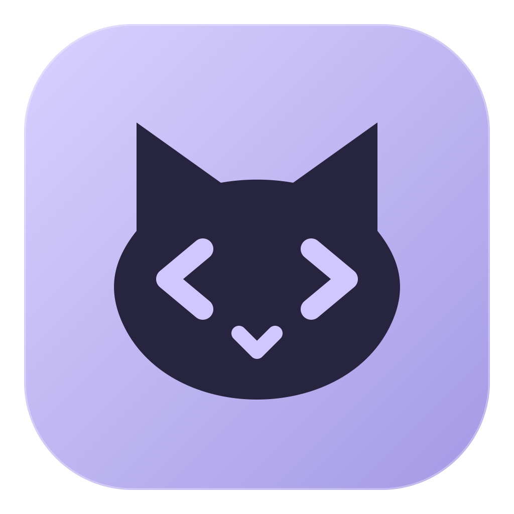
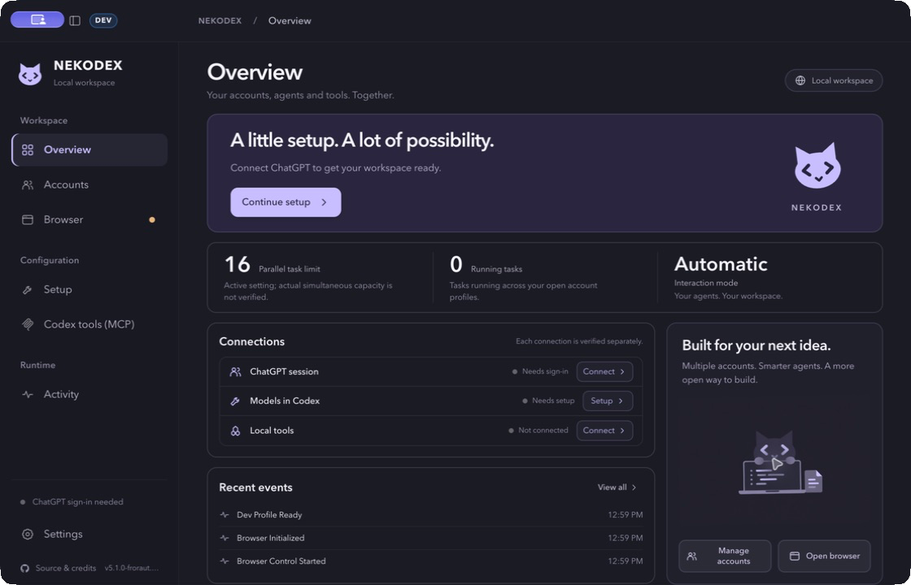
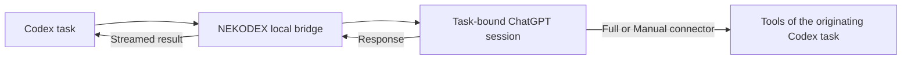

<p align="center">
  
</p>

<h1 align="center">NEKODEX</h1>

<p align="center">
  <strong>Your accounts. Your agents. Your workspace.</strong><br />
  A desktop companion that connects ChatGPT sessions to Codex tasks and local tools.
</p>

<p align="center">
  <a href="#download">Download</a> ·
  <a href="#first-launch">Get started</a> ·
  <a href="#choose-your-mode">Interaction modes</a> ·
  <a href="TROUBLESHOOTING.md">Troubleshooting</a> ·
  <a href="#development">Development</a>
</p>

---

NEKODEX brings separate account profiles, an embedded browser, model setup, MCP connections and runtime activity into one desktop workspace. Work in Codex, keep your ChatGPT sessions in NEKODEX, and connect local tools when your task needs them.

The interface uses a quiet graphite-and-lavender palette, responsive layouts and an interactive coding cat.

### New in 5.5

## Native6 in 5.6

New Automatic Full setups now choose **Codex Native6** (DEV: **Codex Native6 DEV**).
It combines the existing synchronous tools and owned asynchronous start/poll/cancel/ack flow
with a metadata-only operation status tool for recovering operation IDs after context or
transport loss. Status never executes or acknowledges a tool. Read each terminal result before
acknowledging it; expired payloads are reported as lost and cannot silently replay the action.

Existing Native4/5 routes retain their exact identity during an ordinary application update.
Use the visible Native6 upgrade action, create a **new** ChatGPT connector with the exact name
and corresponding tunnel, then verify it. Renaming an old connector does not replace its cached
schema. Native4 remains an explicit synchronous compatibility option. Operation ownership is
process-local; cancelling after dispatch stops observation, not external side effects.


- **Web and Native statistics:** separate browser-message and proxied-model-request reports, Web
  account filters, full day calendars, outcome rates, observed median/p95 durations, and private
  aggregate CSV export. Native token values show reporting coverage; missing usage is never zero.
- **Long-running tools:** opt into a separately created and verified **Codex Native5** connector
  in Automatic Full mode. Start/poll/ack keeps one operation owned while waiting; Native4 remains
  the synchronous default and Zero Risk4 is unchanged. Pending operations do not survive a broker
  restart, and post-dispatch cancellation stops observation rather than reversing external work.
- **Safer recovery:** parallel checkpoints preserve each other's records, routing keeps task/account
  ownership, login evidence matches its exact state, and exit/update drain protects active work.
- **More usable controls:** active-tab quick access, keyboard-contained dialogs, correct selectors,
  stable statistics during refresh failures and guarded update installation.

See the [hardening scope and evidence](docs/reviews/product-hardening-20260920/plan.md).
The comparison baseline is upstream `eaf4f09`; the report records the implemented capabilities
and the remaining external-service and verification limits.



## Download

**NEKODEX 5.6.0-nekodex.1 · prerelease · macOS 13 or later / Linux x64**

| Your Mac | Download |
| --- | --- |
| **Apple Silicon** — M1 and later | [Download ARM64 DMG](https://github.com/Froraut/NEKODEX/releases/download/v5.6.0-nekodex.1/NEKODEX-5.6.0-nekodex.1-mac-arm64.dmg) |
| **Intel** | [Download Intel DMG](https://github.com/Froraut/NEKODEX/releases/download/v5.6.0-nekodex.1/NEKODEX-5.6.0-nekodex.1-mac-x64.dmg) |

Both macOS builds are **Developer ID signed and Apple notarized**, including the final DMGs with stapled notarization tickets.

[Release page](https://github.com/Froraut/NEKODEX/releases/tag/v5.6.0-nekodex.1) · [Checksums](https://github.com/Froraut/NEKODEX/releases/download/v5.6.0-nekodex.1/checksums.txt) · [Build and signing record](https://github.com/Froraut/NEKODEX/actions/workflows/release.yml)

Linux x64: [Download AppImage](https://github.com/Froraut/NEKODEX/releases/download/v5.6.0-nekodex.1/codex-web-gpt-5.6.0-nekodex.1-linux-x64.AppImage).

Windows x64 is built separately as an **unsigned preview** installer and ZIP in the
[release workflow artifacts](https://github.com/Froraut/NEKODEX/actions/workflows/release.yml).
It has no Authenticode publisher certificate and is not delivered through authenticated in-app updates.
The preview artifact is retained for 90 days; downloading Actions artifacts requires GitHub sign-in.

### Install

1. Download the DMG matching your Mac.
2. Quit the existing installation, if it is running.
3. Open the DMG and drag **NEKODEX** into **Applications**.
4. Launch NEKODEX and choose **Continue setup**.

### Update from inside NEKODEX

Choose **NEKODEX → Check for updates…** from the macOS menu, or open **Updates** in the sidebar. Then choose **Download and restart** when a new version is available. The screen shows download progress and package verification; NEKODEX restarts itself to finish installation. Account profiles and settings are preserved. Finish active tasks before updating.

The app checks its own GitHub releases, including the NEKODEX prerelease channel. Updates require the publisher's signed metadata and a verified package. If GitHub's anonymous API quota is exhausted, the app can discover the release through GitHub's public feed and authenticate the same signed metadata. No GitHub token is needed.

<details>
<summary><strong>Upgrading from an older installation</strong></summary>

Install the current DMG manually when moving from `.1` or a legacy installation. Earlier binaries can retain the previous repository identity or executable name in their updater trust policy.

Existing account/profile storage locations remain compatible. Keep the old app closed during the transition and preserve its Application Support and profile folders. Remove an obsolete app bundle only after confirming NEKODEX opens correctly.

Some internal archive names, CLI commands, environment variables and service identifiers retain legacy names for compatibility. The product and installed application are **NEKODEX**.

</details>

## Your workspace

| Surface | What you can do |
| --- | --- |
| **Overview** | See connection readiness, setup guidance, task capacity and recent events. |
| **Accounts** | Keep separate browser profiles; select an account or balance eligible new tasks across accounts. |
| **Browser** | Open task-bound ChatGPT sessions and retained conversations inside the app. |
| **Setup** | Install the Codex model connection and follow the next required setup step. |
| **Codex tools (MCP)** | Connect the active Codex task's tools through the configured connector. |
| **Activity & Settings** | Inspect runtime events and manage interaction mode, models and resource preferences. |

Continuing conversations stay with their owning account. The default parallel-task ceiling is **16** and can be changed in Settings; actual throughput still depends on account limits, available models and local resources.

## First launch

You need **Codex**, a **ChatGPT account**, and an internet connection. Available models depend on your account and workspace.

1. **Add your account.** Open Accounts and sign in through its browser profile. In Automatic mode, check the account's model availability.
2. **Connect Codex.** Follow Setup to install the model route. Restart Codex when prompted and confirm its model picker has loaded the NEKODEX entries.
3. **Choose how to interact.** Use Automatic for browser-driven sending, or Manual to paste and send prompts yourself.
4. **Connect tools if needed.** Follow Codex tools (MCP) for Full or Manual tool access. Browser-only operation does not require that connector.
5. **Run a small task.** Confirm a response returns to the originating Codex task. If you configured tools, confirm an actual tool result as well.

A saved setup, loaded model catalog and verified connector represent different steps. The Overview shows their status separately.

## Choose your mode

| Mode | Who sends the prompt? | Tool connection |
| --- | --- | --- |
| **Automatic · Browser-only** | NEKODEX prepares and sends it through the browser. | No MCP tool connection. |
| **Automatic · Full** | NEKODEX prepares and sends it through the browser. | Tools of the active Codex task through **Codex Native4**. |
| **Manual** | You paste the prepared prompt, choose the model and connector, then send. | Select **Codex Zero Risk4** for the turn. |

Manual mode leaves ChatGPT page interaction to you. Its routed input is text-only; attach images yourself in ChatGPT when needed. The internal `zero-risk` route names are compatibility identifiers, not a claim that a workflow has no risk.

### Connect local tools

The in-app MCP guide walks through the tunnel, credentials and connector setup:

1. Create the tunnel and restricted tunnel key for the account you use with ChatGPT, then save them in NEKODEX.
2. Connect the local runtime using the guide and wait for the tunnel to be ready.
3. Create the connector in ChatGPT using the exact name for your mode and the matching tunnel.
4. Review its tools and permissions, then return to NEKODEX to verify the connection. In Manual mode, connector selection remains your responsibility for each turn.

| Profile | Connector name |
| --- | --- |
| Automatic Full | `Codex Native4` |
| Manual | `Codex Zero Risk4` |
| Isolated DEV Full | `Codex Native4 DEV` |

When upgrading from an earlier connector generation, follow the [connector identity migration guide](docs/connector-identity-migration.md). Create the new connector as instructed rather than renaming an old one; keep each mode's tunnel and credentials associated with its own profile.

Codex retains control of tool execution, sandboxing and approvals. See [MCP troubleshooting](TROUBLESHOOTING.md#full-harness-or-mcp-verification-fails) if verification fails.

## How it works



NEKODEX handles browser sessions, routing and the connection between the response and its task. Codex owns the task and tool approvals. Native model requests retain their upstream route.

### Privacy and reliability

- **Separate profiles:** accounts use separate saved browser sessions. ChatGPT processes prompts remotely; this is not local model inference.
- **Scoped tool access:** tool calls are tied to the originating turn. Cancellation and timeout retire the affected binding.
- **Current connection evidence:** readiness is invalidated when relevant account, mode or runtime state changes.
- **Recoverable setup:** managed configuration changes use ownership checks and compensation to preserve detected external edits.
- **Bounded resources:** event queues and runtime operations have limits; the configured task ceiling does not increase subscription allowance.

NEKODEX is an unofficial integration and does not bypass ChatGPT account or workspace policies. See the [security model](docs/security-model.md) and [release authenticity guide](docs/release-signing.md) for details.

## Development

Development requires Bun 1.4.0. Packaging requires a native host for the target operating system and architecture.

The development launcher also requires Node.js for Vite's native dependencies. Its private Vite
child selects an available loopback port and reports readiness over IPC, so it cannot accidentally
attach to an older server on port 4178. Stopping the runner closes its own Electron and Vite processes.

```bash
git clone https://github.com/Froraut/NEKODEX.git nekodex
cd nekodex
bun install --frozen-lockfile
bun install --frozen-lockfile --cwd launcher
bun run dev:launcher
```

The DEV launcher uses isolated configuration, browser storage and runtime paths. It does not replace the installed application. See [DEV setup and isolation](docs/dev-chat.md).

| Command | Purpose |
| --- | --- |
| `bun run dev:launcher` | Start the isolated development launcher. |
| `bun run typecheck` | Check backend TypeScript. |
| `bun run launcher:typecheck` | Check renderer TypeScript. |
| `bun run app:package` | Build a local package for the current host. |

Local packaging does **not** establish Developer ID signing or Apple notarization. Publisher releases use the authenticated [release workflow](.github/workflows/release.yml).

For changes, select small relevant checks and inspect affected callers. Do not treat a passing typecheck or a local package as proof of live account behavior. Contribution guidance is in [CONTRIBUTING.md](CONTRIBUTING.md).

## Documentation and help

| Topic | Guide |
| --- | --- |
| Setup problems and recovery | [Troubleshooting](TROUBLESHOOTING.md) |
| System design | [Architecture](docs/architecture.md) |
| Interface and compatibility | [NEKODEX design](docs/design/nekodex.md) |
| Connector upgrades | [Connector identity migration](docs/connector-identity-migration.md) |
| Updating the app | [Transactional updates](docs/transactional-updates.md) |
| Signature and download trust | [Release signing](docs/release-signing.md) |
| Reporting a vulnerability | [Security policy](SECURITY.md) |
| Bugs and feature requests | [GitHub issues](https://github.com/Froraut/NEKODEX/issues) |

<details>
<summary>Other language guides</summary>

The [Russian guide](README.ru.md) covers the current release. The [Chinese](README.zh-CN.md) and [Japanese](README.ja.md) guides retain earlier upstream context. They have not yet been fully updated for the current NEKODEX release. Use this English README for current downloads and connector names.

</details>

## License and credits

Maintained by **FroRaut**. NEKODEX builds on [miuuyy/codex-chatgpt-web](https://github.com/miuuyy/codex-chatgpt-web); original authorship and the [MIT license](LICENSE) are preserved. Bundled dependencies retain their own licenses and third-party notices.

NEKODEX is not affiliated with or endorsed by OpenAI.
