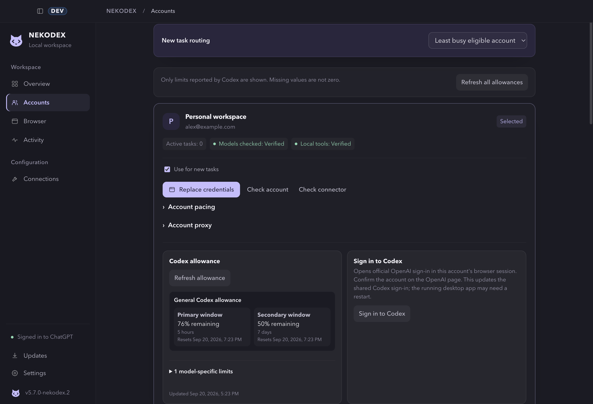
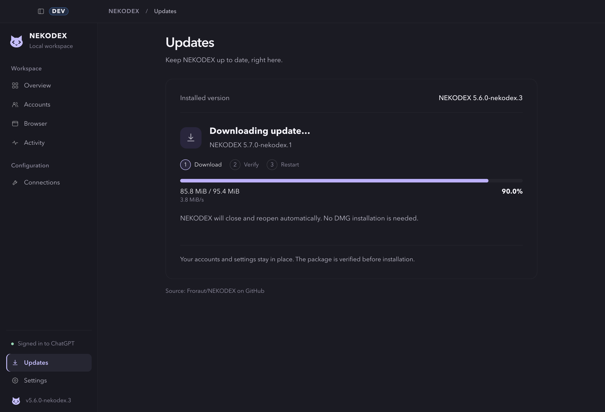

<p align="center">
  
</p>
<h1 align="center">NEKODEX</h1>
<p align="center">
  <strong>Your ChatGPT accounts, Codex tasks and local tools. Together.</strong><br />
  A desktop workspace with separate account sessions, Native6 tools and built-in updates.
</p>
<p align="center">
  <a href="#download">Download</a> · <a href="#get-started">Get started</a> ·
  <a href="#choose-your-mode">Modes</a> · <a href="TROUBLESHOOTING.md">Help</a> ·
  <a href="README.ru.md">Русский</a>
</p>


<p align="center"><sub>Interface preview, captured in an isolated DEV profile with example data.</sub></p>

## Download

**5.9.0-nekodex.5 · prerelease**

| Platform | Package | Delivery |
| --- | --- | --- |
| macOS 13+ · Apple Silicon | [ARM64 DMG](https://github.com/Froraut/NEKODEX/releases/download/v5.9.0-nekodex.5/NEKODEX-5.9.0-nekodex.5-mac-arm64.dmg) | Developer ID signed and notarized |
| macOS 13+ · Intel | [Intel DMG](https://github.com/Froraut/NEKODEX/releases/download/v5.9.0-nekodex.5/NEKODEX-5.9.0-nekodex.5-mac-x64.dmg) | Developer ID signed and notarized |
| Linux x64 | [AppImage](https://github.com/Froraut/NEKODEX/releases/download/v5.9.0-nekodex.5/codex-web-gpt-5.9.0-nekodex.5-linux-x64.AppImage) | Authenticated release metadata |
| Windows x64 | [Preview artifacts](https://github.com/Froraut/NEKODEX/actions/workflows/release.yml) | Unsigned preview; outside authenticated updates |

[Release notes](https://github.com/Froraut/NEKODEX/releases/tag/v5.9.0-nekodex.5) · [Checksums](https://github.com/Froraut/NEKODEX/releases/download/v5.9.0-nekodex.5/checksums.txt) · [Release authenticity](docs/release-signing.md)

On macOS, open the DMG and drag **NEKODEX** to **Applications**. For later releases, use **Updates → Download and restart** inside the app. Account profiles and settings stay in place. Finish active tasks first.

> An older updater can keep the previous working runtime after installing the new app. Use the visible **Restart NEKODEX** action to finish activation. Windows Authenticode signing is not provisioned; Linux compatibility with older distributions is not established by the current-Arch symbol check.

## One workspace

| | What it does |
| --- | --- |
| **Accounts** | Separate saved ChatGPT sessions, selected or balanced routing, per-account Codex allowance refresh, and official Codex device sign-in. |
| **Connections** | Model setup and local-tool setup together, with the exact connector identity and independent readiness checks. |
| **Browser** | Embedded, task-bound ChatGPT conversations. Continuing work stays with its owning account. |
| **Activity** | Separate Web and Native statistics, lifetime history, outcomes, observed durations and CSV export. |
| **Updates** | Download progress, cancellation before installation, package verification and guarded restart/recovery. |

<table>
  <tr>
    <td width="50%"><strong>Account controls</strong><br /></td>
    <td width="50%"><strong>Visible update progress</strong><br /></td>
  </tr>
</table>

New in 5.9: cancellable update preparation, consistent busy/retry controls, and safer account and browser cancellation. Native Codex continues running after the interface exits. [Review and evidence](docs/reviews/full-stack-20260921.md)

## Get started

You need **Codex**, a **ChatGPT account** and an internet connection. Model access depends on your account and workspace.

1. **Sign in:** add an account in **Accounts**. In Automatic mode, check its available models.
2. **Connect models:** open **Connections → Models and Codex route**, complete setup, then confirm the model picker in Codex.
3. **Connect tools:** for Full or Manual mode, follow **Connections → Local tools connector**. Create the exact displayed connector in ChatGPT and verify it.
4. **Try a task:** confirm that a response—and a tool result, when configured—returns to the originating Codex task.

A saved configuration, a delivered model catalog and a verified connector are separate from a successful real task.

## Choose your mode

| Mode | Prompt interaction | Local tools |
| --- | --- | --- |
| **Automatic · Full** | NEKODEX sends and reads the browser conversation | **Codex Native6** for new setups |
| **Automatic · Browser-only** | NEKODEX sends and reads the browser conversation | No MCP connector required |
| **Manual** | You paste the prepared prompt, select the model/connector and send | **Codex Zero Risk4** |

**Native6** combines synchronous tools with asynchronous start, poll, cancellation, acknowledgement and operation discovery. Existing Native4/5 configurations retain their identities; Native4 remains a compatibility option. To upgrade, create a **new connector**, not a renamed old one. The isolated Full DEV connector is **Codex Native6 DEV**. [Migration guide](docs/connector-identity-migration.md)

<details>
<summary><strong>Account, tool and reliability boundaries</strong></summary>

- Allowances come from each account's provider response. Missing or unsupported values remain unavailable; local message counts are not subscription limits. Refresh is explicit and unavailable in Manual mode.
- Quick sign-in opens the official OpenAI device authorization flow in the chosen account's session. It can update the shared Codex sign-in; an already-running Codex desktop may still need a profile check or restart.
- Native requests remain usable when only the Web tool tunnel is unavailable. The UI reports those capabilities separately.
- Closing the window keeps Web available. Quitting the interface preserves native Codex; **Stop connections and quit** stops the service after active work finishes. In the background, native uses its last validated network route; reopen NEKODEX after changing system proxy/PAC settings. The daemon is not an OS-managed restart service.
- Tool execution, sandboxing and approvals stay with Codex. Native6 ownership is process-local; post-dispatch cancellation stops observation and cannot undo an external action.
- Native statistics count only recorded requests. Bounded best-effort telemetry may miss events, including while the interface is closed; missing token usage is not zero.
- The default task ceiling is 16, configurable in Settings. This is not a measured concurrency guarantee or an increase in account allowance.
- Manual input is text-only; attach images yourself in ChatGPT. Internal `zero-risk` names are compatibility identifiers, not a guarantee of no risk.

NEKODEX is an unofficial integration. ChatGPT processes prompts remotely; account and workspace policies still apply. [Security model](docs/security-model.md)

</details>

## Develop

Development requires Bun 1.4.0. Node.js runs the development UI server. The DEV launcher uses isolated configuration and browser storage.

```bash
git clone https://github.com/Froraut/NEKODEX.git nekodex
cd nekodex
bun install --frozen-lockfile
bun install --frozen-lockfile --cwd launcher
bun run dev:launcher
```

[DEV setup](docs/dev-chat.md) · [Architecture](docs/architecture.md) · [Contributing](CONTRIBUTING.md) · [Transactional updates](docs/transactional-updates.md) · [Security policy](SECURITY.md)

Local packaging does not establish publisher signing or notarization. See the [release workflow](.github/workflows/release.yml) for platform delivery. Use the English README for current product details; [Russian](README.ru.md), [Chinese](README.zh-CN.md) and [Japanese](README.ja.md) guides have separate update histories.

---

Maintained by **FroRaut**, built on [miuuyy/codex-chatgpt-web](https://github.com/miuuyy/codex-chatgpt-web). Original authorship and the [MIT license](LICENSE) are preserved; bundled dependencies retain their own licenses.
