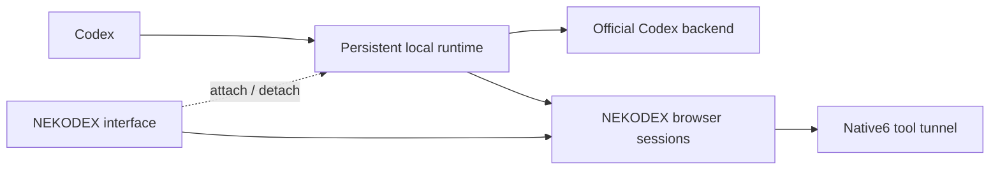

# Native runtime independent of the interface

5.8.0-nekodex.1 keeps the existing Native6 connector contract and the unified model picker.
The lifecycle changes locally; no new ChatGPT connector or copied account credentials are required.

The background daemon owns the stable loopback listener, response streams and retained continuation
state. The interface owns browser sessions and the tunnel's supervision. Ordinary exit atomically
closes Web admission, verifies there are no Web HTTP/browser/compaction owners, stops the tool tunnel,
and releases the daemon. Native streams are not drained by that action. Explicit **Stop connections
and quit**, uninstall and generation replacement still require the existing complete idle drain.

Reopening authenticates the saved daemon instance UUID and PID against the configured control token,
then attaches without replacing it. A live owner or identity mismatch prevents adoption. The process
uses detached execution and has no GUI-owned stdout/stderr pipe that can break when the GUI exits.
The launcher continues to record lifecycle diagnostics; background daemon console output is discarded.
An active generation is retained when an upgrade cannot safely replace it yet.

Native transport keeps its explicit environment proxy semantics. Otherwise, Electron primes a
validated route and refreshes it on successful authenticated proxy resolution. Only a missing
descriptor, dead owner or refused connection to the verified loopback endpoint permits use of that
known route. Authentication errors, unsafe descriptors, unknown routes, invalid PAC responses,
timeouts and cancellation fail closed. An upstream request is never replayed by this fallback.

## Boundaries

- This preserves one mixed native/Web provider. A separate direct-native profile could remove the
  router dependency completely, but would lose switching native/Web models inside the same task.
- Web requests need the browser application. A detached runtime returns a clear reopen-app response.
- A background route is a last validated transport, not a live OS proxy/PAC monitor. Reopen the app
  after changing system proxy configuration. Existing authenticated proxy overrides remain explicit.
- The daemon survives interface exit; it is not an OS KeepAlive service. Machine shutdown, daemon
  failure or network/provider failure can still interrupt requests. Reopening resumes supervision.
- Native usage telemetry remains bounded and best effort; events while the UI receiver is absent
  may be missing. No claim of complete account-wide usage is made.

## Focused development evidence

- A real child owner started the daemon and began a synthetic native stream. The owner detached and
  exited; the stream completed. A replacement owner attached to the same daemon PID, then stopped it
  through the authenticated idle-drain path (one case, 1.75 seconds).
- One mocked network case confirmed that absence of the launcher retained the exact configured
  HTTP proxy rather than switching to direct access (0.12 seconds).
- Runtime type checking and the development renderer build passed. The fixture's CommonJS import
  was corrected after a typecheck failure; the corrected typecheck alone was repeated.
- An isolated real Electron DEV window with a simulated unavailable tray stayed alive and minimized
  when closed. Its native menu exposed interface exit and explicit connection stop (1.22 seconds).
  The initial fixture tried to replace a nonconfigurable Electron export; the corrected fixture
  supplied the fake through its private module loader. Production Electron exports were untouched.
- Web admission fencing, authenticated identity adoption, upgrade deferral, and the proxy refusal
  branches received direct manual review. No full suite or live credential-backed request was run
  as part of these development observations.
