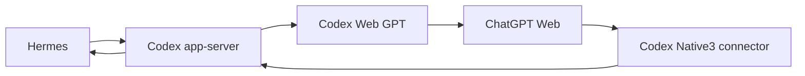

# ChatGPT Web in Hermes

The recommended setup uses **Hermes' Codex runtime**. Hermes supplies the interface and session,
while Codex executes file and command tools and uses this fork's ChatGPT Web model route.
The original direct Hermes Responses provider remains available as an experimental alternative.

## Recommended setup

1. Complete ChatGPT sign-in and Codex tools setup in **Codex Web GPT**. Use the same account in
   the embedded browser, ChatGPT and OpenAI Platform. The connector is installed in ChatGPT.
2. In **Setup → Hermes**, choose **Use Codex runtime in Hermes**.
3. Restart Hermes and start a new session. The selected provider is
   **ChatGPT Web via Codex · FroRaut**, with **ChatGPT Web High** selected by default.
4. Keep Codex Web GPT open. Ask Hermes to read or edit a file in the session's workspace using
   its available tools. In this runtime, file operations use Codex tools such as `exec_command`
   and `apply_patch`; do not require a tool literally named Hermes `read_file`.

The installer adds `providers.codex-web-native`, uses `transport: codex_app_server`, and selects
that provider's Web High model for new sessions. It backs up the existing Hermes config and
preserves other providers and unrelated settings. It does not rewrite global Codex permissions,
copy account credentials, migrate every Hermes MCP server, or select a paid API fallback.
Existing sessions retain their old runtime until a new session is started.

## Why a compatibility patch is needed

The inspected Hermes runtime started Codex without forwarding the selected model. Simply
turning on `codex_app_server` could therefore run Codex's default model while the Hermes UI
showed a Web model. This fork ships a small, reviewable
[model-forwarding patch](../integrations/hermes/codex-model-forwarding.patch): the current
`agent.model` is sent in the app-server `turn/start` request, including subsequent turns.

The installer checks whether the patch is already applied, validates it against the installed
Hermes source before applying it, and backs up the affected files. It refuses an incompatible
Hermes version instead of silently using another model. The patch remains a local compatibility
change in the Hermes checkout and is published here; no changes are pushed to NousResearch.
After Hermes updates, run this setup again. If the upstream implementation changes, the patch
may need review before reapplication. Do not reset or discard unrelated Hermes source changes.

The automatic installer supports `~/.hermes/hermes-agent` with `venv` or `.venv`, and writes to
`HERMES_HOME` or `~/.hermes`. The bridge's private installation receipts are under
`<coreHome>/hermes/`; settings and compatibility-source backups are under
`<hermesHome>/backups/codex-web/`. These private files must not be published.

## Capabilities and limits

Codex owns commands, files, patches, sandboxing and tool approvals in the selected runtime.
Installed Codex tools remain subject to their existing permissions and account access.
Hermes' own in-loop `memory`, `delegate_task`, `session_search` and `todo` tools are not available
in the same way. A curated Hermes MCP callback can be configured separately, but this installer
does not promise or migrate it automatically. Auxiliary models, existing scheduled jobs and
other profiles are not reconfigured by this provider installation.

The bridge's authenticated catalog provides actual per-mode usable context budgets. Hermes
requires at least 64k; smaller modes are omitted rather than inflated. The initial 32k provider
value was corrected in pre8. The Codex runtime uses the normal native Codex model catalog and
this fork's existing account/model restrictions. API credentials in the custom-provider entry
are a separate local catalog token, not an OpenAI model API key.

## Verification

A real Hermes AIAgent using the patched `codex_app_server` runtime and `chatgpt-web/high`
completed a file-read task in **72.84 seconds**. Hermes emitted actual `exec_command` start and
completion callbacks, received the independently prepared marker from the file, and received
the model's final answer. The marker was not included in the user prompt. The answer escaped
underscores as Markdown, so raw string equality differed; the rendered answer represented the
same marker. This proves that mode's model/tool/final-response cycle, not every tool, tier,
operating system or background workflow.

Before this, a test incorrectly demanded Hermes' `read_file` in the Codex runtime. The model
correctly reported that this tool was not advertised. The successful task used an available
file or command tool, matching the runtime selected by the user.

## Experimental direct runtime

Expand **Experimental direct Hermes runtime** in Setup to add `providers.codex-web` without
changing the selected default. This path uses `/hermes/v1/responses` and keeps Hermes' own
agent loop. It requires the same ChatGPT connector for tool calls.

The direct adapter's local contract was exercised with real Hermes, an isolated profile and a
synthetic model: Hermes executed a deferred arithmetic tool for 20 + 22 and received `42` through
the complete Responses continuation. That proves the client contract, not the ChatGPT layer.
Live direct-mode Instant and High file-read attempts stopped after successful MCP inventory
replies, before the execution request reached Hermes. ChatGPT returned a safety-block message;
a structured cloud-side rejection was not recovered. More permissive local settings are not a
demonstrated repair. See [the direct-mode investigation](reviews/2026-09-14-live-blocks.md).

The direct endpoint checks a private bearer token, session-scoped prompt cache identity, full
history and issued tool-call IDs. It rejects foreign/expired continuations, native Codex metadata
and native compaction controls. It never executes a function locally or treats plain model text
as a command. Native Codex's original endpoint retains its environment and approval checks.

## Recovery

- Wrong model: verify `codex-web-native` and `codex_app_server` are selected, and reapply the
  checked compatibility setup after a Hermes update. A model label alone is not execution proof.
- Missing literal `read_file`: use the file/command tools actually supplied by the Codex runtime.
- Missing connector or empty tunnel list: compare accounts/workspaces before creating duplicates.
- Direct-provider 401: update the provider from Setup; do not substitute an admin or OpenAI key.
- Incompatible compatibility patch: retain the backup and inspect the changed Hermes version.
- Removal: select another provider, then remove only the corresponding provider entry. Do not
  restore an old entire config over unrelated changes. Reversing the local source patch should
  be reviewed against the current Hermes source, not forced after an update.

References: [Hermes Codex runtime](https://github.com/NousResearch/hermes-agent/blob/main/website/docs/user-guide/features/codex-app-server-runtime.md),
[Hermes Responses transport](https://github.com/NousResearch/hermes-agent/blob/main/agent/transports/codex.py).
