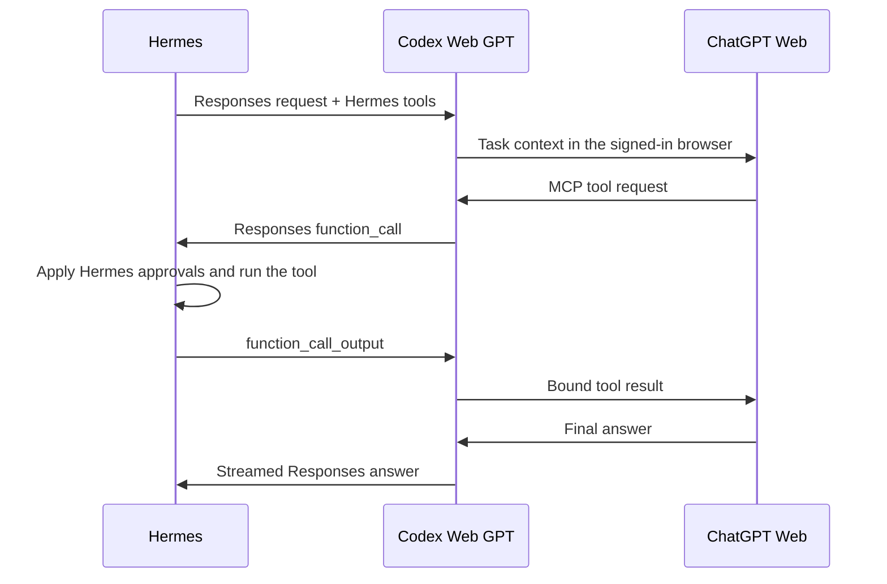

# Hermes integration

The fork exposes a separate, authenticated **Responses API** provider for Hermes. Hermes keeps
its own conversation loop and executes its own tools. The local application supplies ChatGPT
Web responses and relays structured tool requests through the ChatGPT connector.

## Setup

1. Install and start Hermes normally. This integration does not install Hermes itself or alter
   its source tree.
2. In Codex Web GPT, sign in, test the browser response and finish **Codex tools (MCP)** in
   Automatic mode. The ChatGPT connector remains necessary for tool calls. An available tunnel
   by itself is not sufficient.
3. In **Setup → Hermes**, click **Add Hermes provider**. The installer backs up the existing
   Hermes settings, adds `providers.codex-web`, and creates a separate local bearer credential.
   Existing providers and the selected/default model are preserved.
4. Restart Hermes to refresh its configuration. In a **new Hermes session**, choose
   **ChatGPT Web · FroRaut** and one of its models. The provider must use
   `transport: codex_responses`, not `chat_completions` or `codex_app_server`.
5. Keep Codex Web GPT open. First request a short reply, then ask Hermes to use one enabled
   tool on a disposable fixture and check the actual tool result in Hermes.

The automatic installer supports the usual Hermes checkout at `~/.hermes/hermes-agent` with
`venv` or `.venv`. It writes to the configured `HERMES_HOME`, or `~/.hermes` by default.
For a custom installation, run `launcher/electron/hermes-config.py` with that installation's
Python (PyYAML required). Its JSON stdin takes `hermesHome`, `coreHome`, `port`, `contextWindow`
and the available `models` array. Use actual local paths and catalog values; no OpenAI API key
belongs in this input. The helper generates the local credential and returns only a receipt.

The local provider URL is `http://127.0.0.1:<bridge-port>/hermes/v1`. It supports authenticated
`GET /models` and `POST /responses`. The installer sets the actual port. No remote endpoint or
paid API fallback is selected. Auxiliary Hermes models, fallbacks, scheduled jobs and existing
sessions keep their previous settings; changing the main provider does not prove those use Web.

## Tool and session behavior

- Hermes supplies function schemas. `codex_tool_inventory` and `codex_tool_call` expose only
  that current registry. The Responses function call goes back to Hermes for execution and
  permission checks; the bridge does not run the function or reinterpret plain text as a command.
- This keeps Hermes-native memory, delegation and enabled plugins available through its normal
  loop. Availability still depends on the actual Hermes session, enabled toolsets and credentials.
  A successful file tool does not prove every external plugin, browser or image tool works.
- Requests must contain a session-scoped `prompt_cache_key` and full history, as the inspected
  Hermes Responses transport does. Producer identity is separate from native Codex metadata.
  The endpoint rejects caller-supplied Codex metadata, unknown models and native compaction
  controls. Native Codex's environment checks remain in effect on its original endpoint.
- Continuations must include the issued tool calls and corresponding results. Another session
  cannot consume them. Simultaneous requests to one conversation are rejected. After a daemon
  restart or 30 minutes of inactivity, start a new user turn instead of replaying a pending tool
  result. Hermes context compression starts a fresh browser turn; native Codex compaction is not
  advertised for this provider.
- The initial installer uses a conservative **32,000-token maximum** for Hermes model entries
  (or a smaller configured limit). This is a client transport budget, not a claim about the
  underlying model's full window. Large inline contexts and attachments retain the browser
  adapter's limits. Manual mode is not offered by this integration.

## Recovery and removal

For `401`, add/update the provider from Setup and reload Hermes; do not reuse the bridge's admin
token or an OpenAI runtime key. For `404`, check the exact `/hermes/v1` URL and Responses transport.
For missing tools, finish the ChatGPT connector and verify it uses the same account as the
embedded app; then inspect Hermes' enabled toolsets. An empty tunnel list in another account
does not mean the existing tunnel was deleted.

The private key is stored at `<coreHome>/hermes/provider-token` and in the private Hermes config.
The installer stores a receipt without the key at `<coreHome>/hermes/installation.json`; original
settings backups are under `<hermesHome>/backups/codex-web/`. Do not publish any of these files.
The installer refuses to overwrite a manually changed `codex-web` entry. For removal, select
another provider in Hermes, remove only `providers.codex-web` in its settings and delete the local
`provider-token` to revoke access. Keep unrelated settings and sessions; restoring an old entire
config can overwrite changes made since installation.

## Why not Hermes' Codex runtime?

Hermes also has an optional `codex_app_server` runtime. Its documented stateless Hermes MCP
callback does not expose its in-loop `memory`, `delegate_task`, `session_search` and `todo`
tools. This integration uses Hermes' normal loop instead. See the
[Hermes runtime documentation](https://github.com/NousResearch/hermes-agent/blob/main/website/docs/user-guide/features/codex-app-server-runtime.md)
and [Responses transport source](https://github.com/NousResearch/hermes-agent/blob/main/agent/transports/codex.py).

## Evidence boundary

The focused regression verifies a Responses function call and its continuation through the
production parser/serializer, separate producer identity, no forwarded local bearer key, and
rejection of a foreign-session result. This is protocol evidence with a fixture adapter. Live
ChatGPT-to-Hermes tool execution requires the account connector and a separate observed result;
do not equate a saved provider entry with that outcome.

On 2026-09-14, the provider was added through the installed macOS app. The authenticated local catalog returned five configured Web models. Comparing with the installer backup confirmed that other providers and all non-provider settings were preserved, with private config permissions. The matching ChatGPT/Platform account has been confirmed and its tunnel is visible in ChatGPT. Live tool execution is still pending runtime-key replacement and final connector acceptance.
