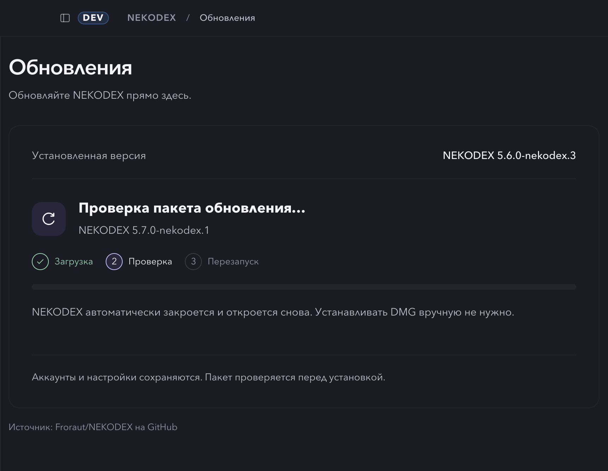

# Product Design: update and account flows

Scope: the current NEKODEX implementation, existing brand/assets, and the user's request to fix
remaining layout, action and animation problems. Captures use the real renderer with synthetic
backend responses. No live installation or account switch occurred during these scenarios.

1. **Download — healthy after refinement.** The current version and candidate stay distinct,
   observed bytes/speed/percentage share one transfer area, and real updater phases show what follows.
   The 1.2-second progress sample changed smoothly without exceeding reported progress.
2. **Package verification — healthy in the observed compact Russian layout.** Download is marked
   complete and verification is current. Indeterminate animation does not invent a completion
   percentage. Version labels, controls and explanatory text remain within the window.
3. **Reduced motion — passed.** Verification's animated fill is static under the accessibility
   preference. This observation does not establish full screen-reader or WCAG compliance.
4. **Login status failure and retry — passed.** The account service's simulated first failure
   produces an explicit Retry action. A successful retry restores the sign-in action. The existing
   login/copy/cancel scenario also preserves the selected Web routing account.
5. **Allowance and sign-in card — healthy after compacting.** Repeated coverage prose is removed,
   optional per-model details are collapsible, and the short sign-in action stays on a usable button.
   General allowance remains visible; omitted provider values remain unknown.

Download with synthetic progress:

Compact Russian verification phase:

Synthetic account allowance and official sign-in controls:

The captures support the listed layout and interaction conclusions. Provider quota acceptance,
real authorization, actual package verification, install/restart and performance on other machines
remain separate runtime observations. Existing assets were sufficient; no generated replacement
branding was needed.
