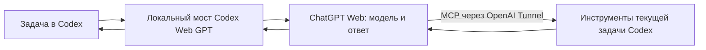

# Как работает Codex Web и как упростить настройку

Проверено по исходникам форка и документации исходного проекта 14 сентября 2026 года.
Разбор открытых issues и PR: [таблица расследования](reviews/2026-09-14-investigation.md).

## Где проходит работа

Пользователь пишет задачу **в Codex** и выбирает модель **ChatGPT Web**. Локальное приложение
Codex Web GPT передаёт контекст задачи в принадлежащий ему браузер ChatGPT и возвращает ответ
в ту же задачу Codex. В режиме Full вызовы инструментов идут обратно через MCP и проверяются
исходным окружением Codex, включая его sandbox и approvals.

Это подключение источника моделей, а не плагин, который сам добавляет модели в Codex.
**Коннектор MCP создаётся в ChatGPT.** У оригинального v5.0.6 это `Codex Native2`, у данного
форка — `Codex Native3`. Имя версии связано с публичной схемой инструментов. Оно не является
способом обхода ограничений сервиса. [Оригинальная инструкция Full harness](https://github.com/miuuyy/codex-chatgpt-web#full-harness),
[миграция схемы форка](mcp-task-access-migration.md).

У официального `tunnel-client` действительно есть команда `codex plugin install`. Её плагин
управляет туннелями из Codex. Он не заменяет модельный мост и не устраняет необходимость
ChatGPT-коннектора для обратных вызовов этого проекта. Проверено через локальные команды
`tunnel-client --help` и `tunnel-client help plugin`.

## Последовательность настройки

### 1. Войти в нужный аккаунт

На экране Setup показано, какой аккаунт принят встроенным браузером. Сверяйте его с аккаунтом
OpenAI Platform, в котором создаётся туннель. Название профиля Chrome или старое отображаемое
имя на уже открытой странице недостаточно: интерфейс может обновлять их асинхронно.

- **Use existing Chrome sign-in:** используется уже авторизованный обычный Chrome. Для этого
  требуется поддерживаемое подключение Chrome и его явное разрешение. При отказе macOS в
  доступе к файлу подключения приложение предлагает выбрать только `DevToolsActivePort`.
- **Open sign in:** обычный вход в принадлежащем приложению браузере.
- **Use passkey:** отдельный браузерный путь, если passkey не работает в Electron.

Смена способа входа не должна создавать новую учётную запись. Перенос cookies подтверждается
только после проверки авторизации внутри приложения. Если Chrome подключился, но проверка
входа не прошла, повторное включение Chrome debugging не является универсальным исправлением.
См. [подробности входа через Chrome](existing-chrome-sign-in.md).

### 2. Проверить ответ и установить модели

**Test connection** отправляет один короткий временный запрос в режиме High. После успешного
ответа **Install models** сохраняет обратимое подключение к Codex. Установка и обновление
каталога — разные события: уже открытый Codex может хранить прежний каталог.

Если отображается ожидание каталога, сохранённую установку не нужно повторять. Откройте
список моделей в новом процессе Codex; приложение, внутри которого работает Codex, может
называться ChatGPT. При продолжающемся ожидании используйте **Check Codex routing**: важны
реальный Codex home, provider, переопределение каталога, совпадение маршрута и наблюдаемый запрос.
Проверка отдельным CLI подтверждает CLI-маршрут, но не обновляет кэш уже открытого desktop-клиента.

### 3. Подключить инструменты

Для чтения файлов, команд и правок нужен **Codex tools (MCP)**. Режим models-only позволяет
получать ответы, но не предоставляет эти инструменты. В UI это теперь явное различие.

1. В OpenAI Platform создайте или используйте туннель, связанный с нужной организацией **и**
   рабочим пространством ChatGPT. Не создавайте новое рабочее пространство, если нужное уже есть.
2. Создайте обычный Restricted API key с **Tunnels Read + Use**. Admin key для работающего
   приложения не нужен. Этот ключ запускает туннель, а не оплачивает inference модели.
3. Введите Tunnel ID и ключ в приложении, нажмите **Connect harness** и дождитесь готовности.
4. Кнопка **Open ChatGPT Developer mode** ведёт в нужную настройку. После включения откройте
   **Plugins → Create app (+)**. Это каталог Plugins, а не только список уже установленных плагинов
   в Settings.
5. В форме выберите **Tunnel**, созданный работающий туннель, **Authentication: None** и точное
   имя **Codex Native3**. Проверьте обнаруженные действия.
6. Проверьте область применения permissions. Настройка на уровне всех плагинов имеет более
   широкий эффект, чем настройка одного коннектора. Команды и правки требуют допуска в ChatGPT;
   native sandbox и approvals Codex при этом сохраняются.
7. Вернитесь в приложение и выполните **Verify runtime**, затем небольшую реальную задачу Codex.

Создание/изменение туннеля требует **Read + Manage**, его использование — **Read + Use**.
Доступ к Developer mode задаётся отдельно от прав Platform. Локальное приложение не может
самостоятельно заменить эти внешние разрешения. [Официальные права и привязка туннеля](https://developers.openai.com/api/docs/guides/secure-mcp-tunnels),
[создание и проверка коннектора](https://developers.openai.com/plugins/deploy/connect-chatgpt).

### 4. Проверить результат

Зелёный локальный health не доказывает, что ChatGPT получил коннектор или вызвал инструмент.
Нужна задача, которая получает заранее неизвестное ей содержимое отдельного тестового файла.
Сопоставьте native результат, ответ модели и завершение browser turn. Не используйте секреты
или рабочие документы как тестовые маркеры. Перезапуск приложения должен сохранять вход.

## Что удалось упростить

В форке добавлены отдельные состояния готовности моделей, туннеля и коннектора; заметная кнопка
продолжения настройки инструментов; актуальные прямые ссылки; явное имя вошедшего аккаунта;
точная причина сбоя импорта; запрет повторной установки при ожидающем каталоге; дополнительный,
свёрнутый по умолчанию видеогид. Предупреждения Doctor больше не выглядят как полностью зелёный
результат. Внутренний пустой browser URL не показывается пользователю как закодированный HTML.

Остаются неизбежные действия владельца аккаунта: разрешить вход/подключение, создать или
предоставить ограниченный ключ и разрешить коннектор. Автоматизация через Admin key убрала бы
несколько кликов, но потребовала бы гораздо более широкого доступа; это не выбранный путь.

## Альтернативы и их цена

| Вариант | Что упрощается | Что меняется или остаётся |
| --- | --- | --- |
| **Штатный Codex с входом ChatGPT** | Один вход; инструменты и агентный цикл уже встроены. Наш мост, browser automation и туннель не нужны. | Используются модели и лимиты штатного Codex, а не обещанная отдельная квота веб-режима Pro. |
| **Штатный Codex с API key** | Стабильный API без HTML-селекторов и переноса browser session. | Отдельная тарификация и доступность API-моделей. Переход не выполняется автоматически. |
| **Наш автоматический Full mode** | Сохраняет работу в Codex и веб-модели ChatGPT; после первоначальной настройки действия выполняет приложение. | Зависит от ChatGPT UI, аккаунта, туннеля и разрешений коннектора. Это основной путь данного форка. |
| **ChatGPT Work** | Готовый агент для исследований и документов; локальные файлы доступны в поддерживаемом desktop-режиме. | Другой рабочий процесс. Work следует структуре использования Codex; это не способ получить отдельный безлимитный бюджет. |
| **Manual mode** | Убирает автоматическое управление ChatGPT браузером. | Каждый промпт отправляется вручную; изображения тоже требуют ручного прикрепления. Для желаемой непрерывной работы этот режим сложнее. |
| **Плагин управления tunnel-client в Codex** | Управление существующими профилями и статусом туннеля из Codex. | Не заменяет ChatGPT-коннектор и модельный мост. Полезен оператору, но не устраняет первоначальную настройку аккаунта. |

Штатный Codex официально поддерживает вход ChatGPT для подписки и API key для оплаты по
использованию. [Документация авторизации](https://developers.openai.com/codex/auth).
Назначение Work, локальный доступ и его структура использования описаны отдельно.
[ChatGPT Work и Codex](https://help.openai.com/en/articles/20001275/).

### Перспективные изменения транспорта

- **Контекст через MCP, PR #472:** убирает огромный JSON из редактора, сохраняя исходные байты.
  Перед внедрением нужен принудительный контроль получения полного контекста в broker и на
  завершении задачи, ограничение размера/числа частей и проверка сохранённого контекста при
  последующих ходах. Одной просьбы модели прочитать все части недостаточно.
- **TXT-вложение, PR #460–463:** сокращает нагрузку на редактор. Однако загрузка файла и его
  последующее извлечение моделью не эквивалентны гарантированной видимости всего inline-контекста.
  Показатели восстановления тестовых маркеров на Pro не доказывают те же возможности Plus или
  корректную native compaction. Это отдельный режим, а не скрытая замена транспорта.
- **Прямые структурированные tool calls без MCP:** технически можно исследовать перевод строго
  валидированных ответов браузерной модели в native Responses tool items. Это новый протокол,
  требующий защиты от исполнения процитированного текста, точных схем/идентификаторов, отмены,
  обработки изображений и восстановления после compaction. Готового проверенного пути в этом
  репозитории нет; текстовые маркеры `[EXEC_REQUEST]` сами по себе его не обеспечивают.
- **Расширение Chrome для входа:** могло бы заменить широкую отладочную сессию более узким
  разрешением на нужные домены, но добавляет установку расширения, защищённый канал передачи и
  отдельное сопровождение. Оно не гарантирует принятие перенесённой сессии ChatGPT.

Если приоритет — минимальная настройка, штатный Codex проще. Если приоритет — конкретно
веб-модели ChatGPT внутри Codex, разумно сохранять автоматический Full mode и улучшать его
мастер настройки. Эти варианты не следует подменять друг другом без решения пользователя.

## Границы подтверждения

14 сентября до этого изменения были непосредственно проверены вход, сохранение сессии после
перезапуска, ответ High и отдельный запрос `chatgpt-web/high` через установленный Codex.
Туннель запущен и показал ready; создание ChatGPT-коннектора было приостановлено пользователем
ради этого расследования. Поэтому завершённая работа MCP и всех остальных model tiers пока
не заявляется. Подпись Developer ID/notarization и выпуск публичных подписанных бинарников
также требуют отдельных подтверждений.

## Hermes

В форке добавлен отдельный Responses-провайдер для Hermes: **Setup → Hermes → Add Hermes provider**. Hermes сохраняет свой цикл, память, инструменты и разрешения. Подключение ChatGPT MCP остаётся необходимым. Существующая модель Hermes не переключается автоматически. Подробности и границы проверки: [интеграция Hermes](hermes-integration.md).

При продолжении настройки обнаружено различие аккаунтов Platform в Chrome и установленного приложения. Существующий вход и туннель сохранены; пустой список туннелей в другом аккаунте не исправляется созданием дубликата.

Аккаунты затем были приведены к одному: созданный в нужной организации туннель появился в списке ChatGPT. Завершение подключения и реальный вызов инструмента по-прежнему являются отдельными этапами приёмки.
